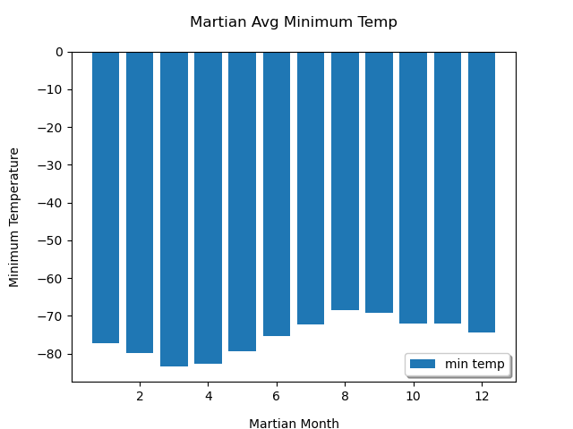
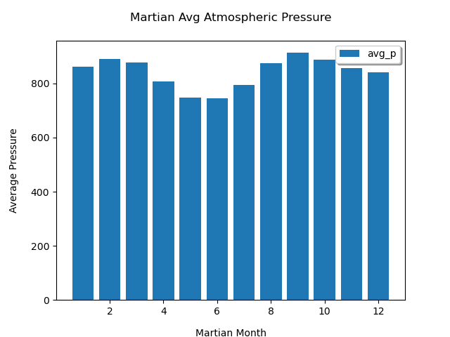
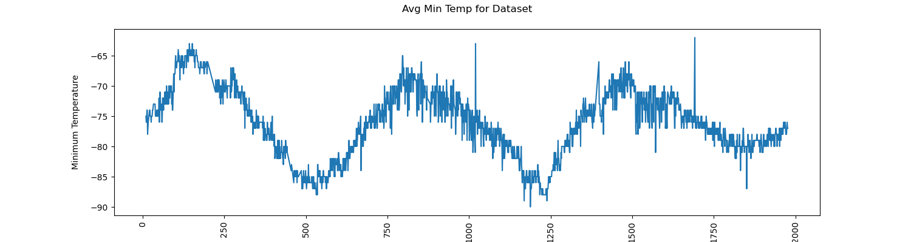

# mars_news_challenge
Module 11 Challenge for Data Analytics Bootcamp

Vincent Passanisi

Due January 5, 2023 / Submitted January 7, 2023

# **Introduction**

This challenge required two deliverables. First, a notebook that scraped a Mars News website for the article titles and preview text. Once the scraping was accomplished, it was saved into a python list. The second deliverable was a notebook that scraped a website with a table that had temperature and atmospheric pressure data collected by Curiosity, a mars-rover vehicle, roughly the size of a car. The data in the table was collected from 8/16/2012 through 02/27/2018, a period of about five-and-a-half years. The table was scraped and a dataframe created from which graphs were produced to display the minimum temperatures and atmospheric pressure grouped by month.

# **Files**

In the folder *mars_web_analysis* are the completed challenge files.

* *part_1_mars_news_final.ipynb* - my jupyter notebook the scraped article titles and preview text.
* *part_2_mars_weather_final.py* - my jupyter notebook the scraped weather table, answers to questions, and output graphs
* *part_2_mars_weather_final_bs* - I created a second notebook that used pd.read.html to collect the table data into a dataframe instead of looping through the beautiful soup object
* *Output* folder with image and .csv files
    * mars_facts.csv
    * martian_min_pressure.png
    * martian_min_temp_total.png
    * martian_min_temp.png

# **Results**

Article titles and preview text were successfully scraped and stored into a pyton list. Below are the first three articles.

    [
        {
            "title": "NASA's MAVEN Observes Martian Light Show Caused by Major Solar Storm",
            "preview": "For the first time in its eight years orbiting Mars, NASA\u2019s MAVEN mission witnessed two different types of ultraviolet aurorae simultaneously, the result of solar storms that began on Aug. 27."
        },
        {
            "title": "NASA Prepares to Say 'Farewell' to InSight Spacecraft",
            "preview": "A closer look at what goes into wrapping up the mission as the spacecraft\u2019s power supply continues to dwindle."
        },
        {
            "title": "NASA and ESA Agree on Next Steps to Return Mars Samples to Earth",
            "preview": "The agency\u2019s Perseverance rover will establish the first sample depot on Mars."
    ]

The average minimum temperature on Mars is highest in month 8 at -68.38 and lowest in month 3 at -83.31.

Martian atmospheric pressure is highest in months 2 and 9, and lowest in month 6 as seen in the graph below.

This graph was used to calculate the number of days in a Martian year. It is assumed that the temperature would be warmest when Mars is closest to the sun, and coolest when Mars is furthest from the sun. Measuring from each peak on the graph and calculating the number of days between peaks would give an approximate number of days in a Martian year. My calculation came reasonably close. I calculated 683 days in a Martian year. Wikipedia states that there are approximately 687 days.

# **Comments and Thoughts**

Overall, I enjoyed this challenge and learned a great deal.